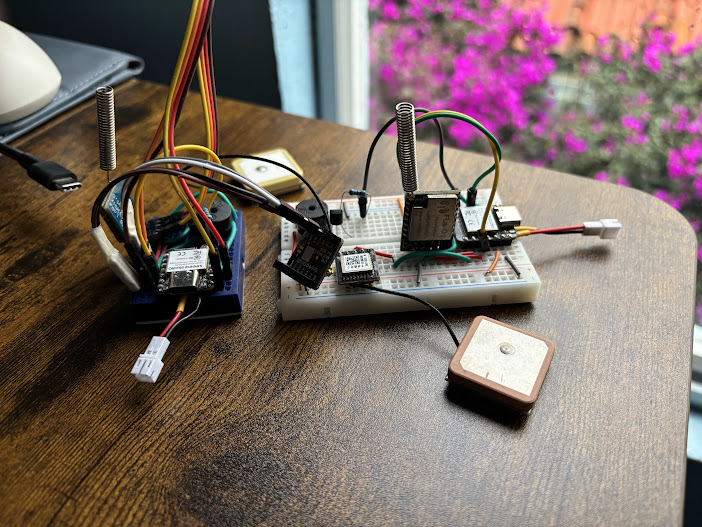
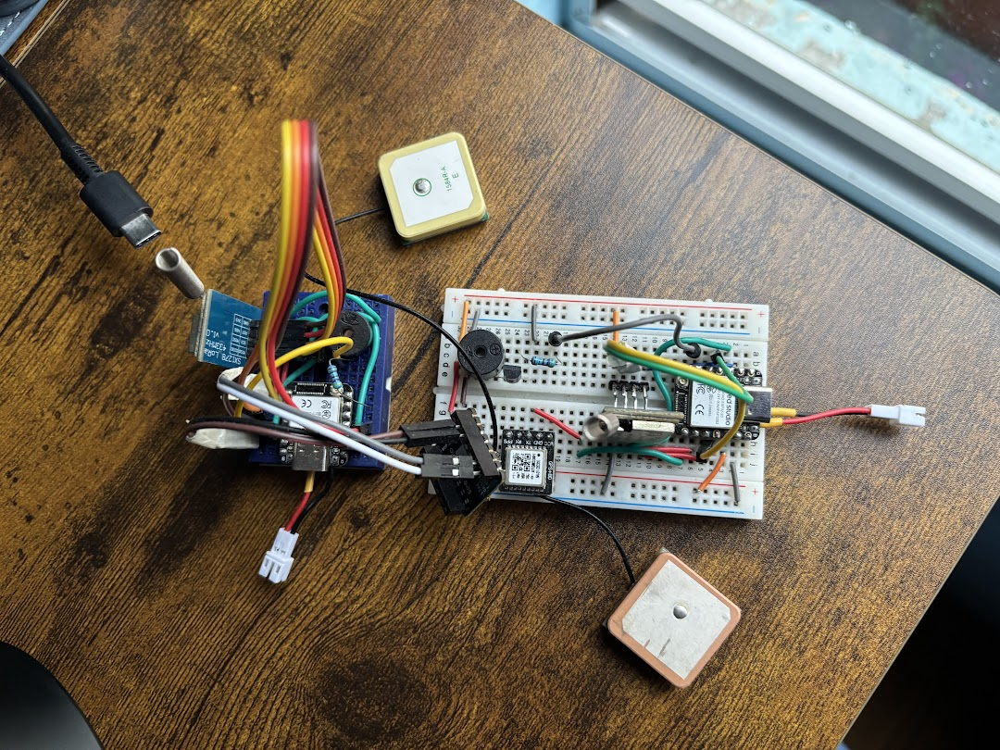

| Supported Targets | ESP32-S3 |
| ----------------- | -------- |

# LoRa GPS Geofence Nodes

[English](README.md) | [Español](README.es.md)

ESP-IDF firmware for battery-powered tracking nodes built on a Seeed XIAO ESP32-S3, an SX1278 LoRa radio at 433 MHz and a UART GPS module. Each node reports its position over LoRa as an AES-128-CTR encrypted packet, receives a target coordinate from the web side of the system, and sounds a buzzer when it moves more than 20 m away from that target.



## How it works

Four FreeRTOS tasks run on each node, all with static stacks except the radio driver task:

| Task | Priority | Job |
| ---- | -------- | --- |
| `lora_driver` | 10 | Woken by the DIO0 interrupt, calls `sx127x_handle_interrupt()` and pushes received packets into a queue |
| `lora_task` | 5 | Waits 4–6 s (random) for a packet; on timeout, sends its own position |
| `geofence_measure_task` | 5 | Every 2 s, compares the current fix against the target and drives the alarm |
| `gps_task` | 4 | Reads NMEA from UART1, parses `$GPRMC`/`$GNRMC` and stores the latest valid fix behind a mutex |

The random receive window keeps two nodes from transmitting in lockstep on the same channel.

### Geofence

The target arrives over LoRa from the web side as an encrypted message in one of two formats:

```
Web Latitude: 19.432608, Longitude: -99.133209
Web:19.432608,-99.133209
```

`receive_helper.c` parses it, pushes it into the geofence queue and confirms it with the LED and one buzzer melody. From then on, `geofence_measure_task` computes the distance between the current fix and the target every 2 s. If it is greater than `GEOFENCE_THRESHOLD_METERS` (20 m), the buzzer plays three times and the node reports `On Target: 0`; inside the radius it reports `On Target: 1`. A new target message replaces the previous one.

The distance uses an equirectangular approximation instead of Haversine:

```
x = Δλ · cos((φ1 + φ2) / 2)
y = Δφ
d = R · √(x² + y²)        R = 6 371 000 m
```

Latitude and longitude are angles, so the east–west difference is scaled by the cosine of the mean latitude before applying Pythagoras. For perimeters under 1 km the curvature of the Earth is negligible and the error stays below 0.1 %, while saving the `sin`/`asin`/`atan2` calls that Haversine needs on every iteration.

### Packet format

Every packet starts with a 4-byte big-endian counter followed by the ciphertext. The counter fills the last 4 bytes of the CTR nonce (the first 12 are fixed and shared with the Raspberry Pi Zero gateway), so the receiver decrypts with the same `encrypt_data()` call.

```
| counter (4 B, big-endian) | AES-128-CTR(payload) |
```

Uplink payload:

```
Node: 1, Lat: 19.432608, Lon: -99.133209, On Target: 1
```

Nothing is sent until the GPS has a valid fix.

## How to use

### Hardware Required

- Seeed Studio XIAO ESP32-S3
- SX1278 LoRa module (433 MHz)
- GPS module with NMEA output at 9600 baud
- Passive buzzer
- LiPo battery on the XIAO battery pads (optional)



| Signal | ESP32-S3 GPIO |
| ------ | ------------- |
| SX1278 SCK | 7 |
| SX1278 MISO | 8 |
| SX1278 MOSI | 9 |
| SX1278 NSS | 4 |
| SX1278 RESET | 3 |
| SX1278 DIO0 | 2 |
| GPS RX (ESP TX) | 43 |
| GPS TX (ESP RX) | 44 |
| Buzzer (LEDC, PWM) | 6 |
| Status LED | 21 |
| Node ID select | 1 |

The node number comes from the level of GPIO1 at runtime: tie it to GND for node 1 and to 3V3 for node 2. The pin has no internal pull configured, so do not leave it floating.

### Radio settings

Defined in `src/drivers/lora_spi.c`. The gateway has to match all of them:

| Parameter | Value |
| --------- | ----- |
| Frequency | 433 MHz |
| Bandwidth | 125 kHz |
| Spreading factor | 12 |
| Coding rate | 4/5, explicit header, CRC on |
| Sync word | `0x12` |
| TX power | 10 dBm on PA_BOOST |

### Configure the Project

The project was built with ESP-IDF v6.0.0 (from `dependencies.lock`). The only external component is [`dernasherbrezon/sx127x`](https://components.espressif.com/components/dernasherbrezon/sx127x) ^5.0.1, which the Component Manager downloads on the first build.

```sh
idf.py set-target esp32s3
```

The committed `sdkconfig` already targets the ESP32-S3 with 4 MB flash; `idf.py menuconfig` is not needed for a default build.

### Build and Flash

```sh
idf.py build
idf.py -p PORT flash monitor
```

## Project layout

| Directory | Contents |
| --------- | -------- |
| `src/main` | `app_main()`: starts the LoRa and geofence tasks |
| `src/app` | Send/receive loop, message parsing, geofence logic |
| `src/drivers` | SX1278 over SPI, GPS over UART, LED, buzzer, pin map |
| `src/util` | AES-128-CTR wrapper on the ESP32 hardware AES |
| `docs` | Prototype photos |

## Limitations

- The AES key and nonce are hardcoded in `src/util/crypto.c` and are public in this repository.
- The TX counter starts at 0 on every boot, so after a reset the node reuses CTR keystreams. The receiver does not check the counter, so there is no replay protection.
- Packets carry no authentication tag; a modified ciphertext decrypts to garbage instead of being rejected.
- Only one target is active at a time, and the radius is a compile-time constant.
- `test_tasks()` in `send_receive.c` is a plain-text echo test kept for bring-up; it is not called from `app_main()`.
